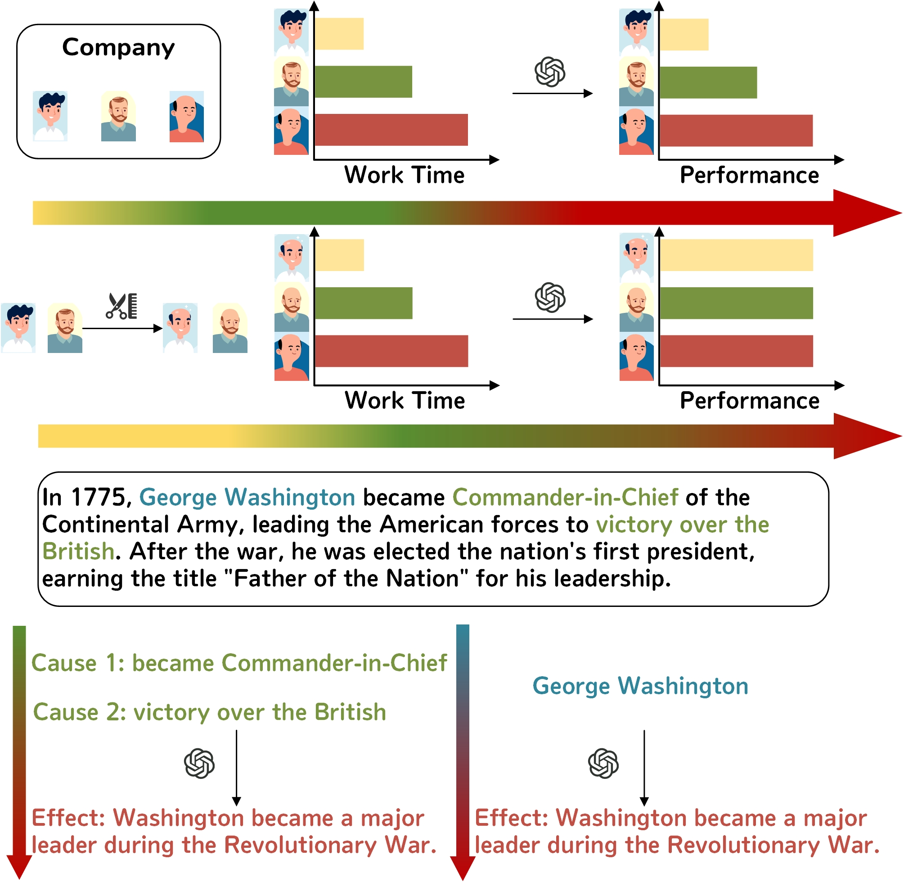

# CausalityCheck
This is the official repository of "CausalityCheck: A  Framework for Evaluating Causal Reasoning in Large Language Models".


**CausalityCheck: A  Framework for Evaluating Causal Reasoning in Large Language Models**


## Motivation

Traditional evaluation methods for assessing causal reasoning primarily focus on task-specific answer accuracy, such as evaluating a model's performance on causal questions using causal reasoning datasets. These datasets typically feature scenarios where models are required to understand and deduce outcomes based on causal relationships. However, current approaches have a significant limitation: they mainly emphasize the model's problem-solving ability while neglecting the quality of the reasoning process itself. This oversight includes issues like misidentifying causal chains and relying on empirical inferences, as illustrated in Figure.

Misidentifying causal chains occurs when a model infers an incorrect causal chain but still arrives at the correct answer. Such errors become evident with minor perturbations. For example, the correct causal chain in the diagram should be: working hours → amount of hair → performance. However, the model incorrectly posited that less hair leads to better performance. When perturbed by shaving everyone bald, the model mistakenly concluded that everyone’s performance would be excellent.

Empirical inference, on the other hand, happens when a model does not construct causal relationships but instead searches for answers within its pre-trained data. In this scenario, the model should identify two causal factors in the given context and infer the outcome based on these causes. However, the model "cheats" by retrieving an answer directly from its training data, without considering the context or understanding the cause of the outcome.


##Installtion

Install dependent Python libraries by running the command below.

```bash pip install -r requirements.txt ```

